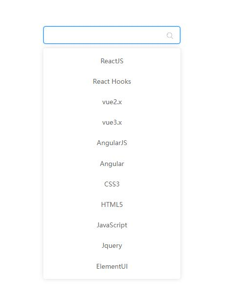
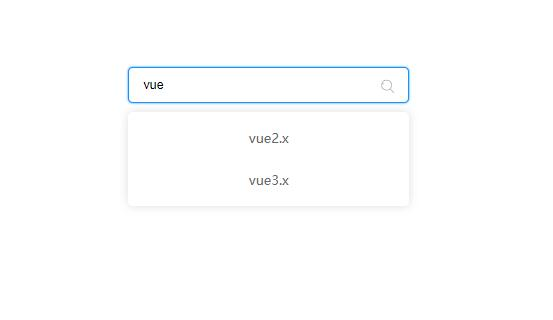
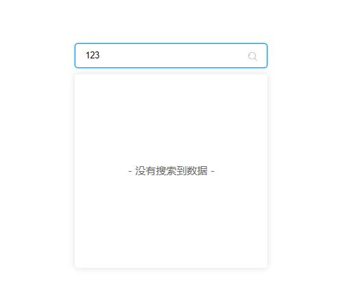

# selector

### 带搜索功能的下拉菜单描述

    本轮播图插件是基于Vue3制作，该插件基本完成，如有改进或bug修复欢迎联系本人

    使用者可以自行在src/data/selector.js修改数据即可达成配置

### 开发记录

    2021/12/1   完成了input组件的编写以及自定义指令开发动态input
                完成了菜单组件的开发、自定义指令控制显示功能
                完成了菜单的点击事件、事件传递与解决一些小bug
                通过filter完成搜索功能
                通过getCurrentInstance获取输入框的ref，完成记忆功能；完成无搜索结果提示组件的编写

    ------------------------------------------

### 样图

