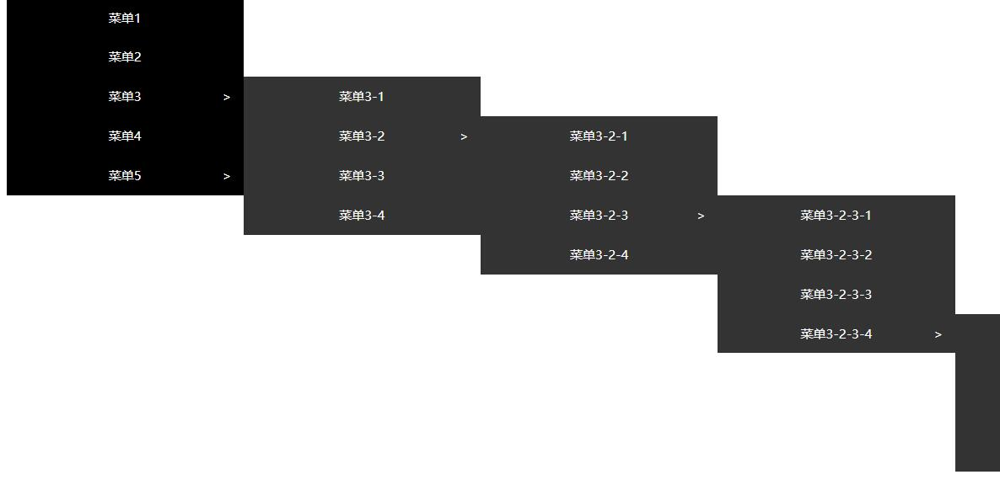

# treemenu

### 五星好评描述

    本模态框插件是基于Vue3制作，该插件基本完成，如有改进或bug修复欢迎联系本人

    使用者可以自行在src/data/menuData.js修改数据即可达成配置

### 开发记录

    2021/11/30  完成一级菜单组件的开发
                完成二级菜单组件的开发与逻辑问题
                完成子菜单显示逻辑 增加menuData完成五层数据
                完成递归组件的开发 增加a标签的样式
    ------------------------------------------

### 样图

