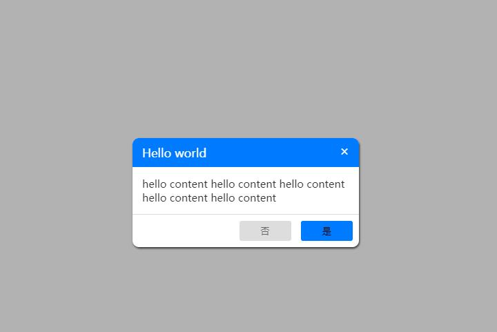

# modal

### 五星好评描述

    本模态框插件是基于Vue3制作，该插件基本完成，如有改进或bug修复欢迎联系本人
    本模态框基础属性受bootstrap启发，特此感谢

```
        <Modal
            :show="true"
            <!-- 是否默认显示 -->
            :width="350"
            <!-- 模态框宽度 -->
            :borderRadius="10"
            <!-- 模态框圆角 -->
            headerColor="#007bff"
            <!-- 模态框标题框颜色 -->
            headerText="Hello world"
            <!-- 模态框标题文字内容 -->
            headerTextColor="#fff"
            <!-- 模态框标题文字颜色 -->
            contentText="hello content  hello content   hello content   hello content   hello content"
            <!-- 模态框主体文字内容 -->
            contentTextColor="#333"
            <!-- 模态框主体文字颜色 -->
            position="center"
            <!-- 模态框位置 (暂时只有center可供选择，其他皆为水平置顶50px)-->
            :btnGroupShow="true"
            <!-- 是否有确认与取消按钮 -->
            confirmText="是"
            <!-- 确认按钮的文字内容 -->
            cancelText="否"
            <!-- 取消按钮的文字内容 -->
            @confirm="modalConfirm"
            <!-- 点击确认触发的函数 -->
            @close="modalClose"
            <!-- 点击取消触发的函数 -->
        ></Modal>


        const modalConfirm = () => {
            console.log('Modal Confirm')
        <!-- 修改确认按钮触发的函数的内容 -->
        }

        const modalClose = () => {
            console.log('Modal Close')
        <!-- 修改取消按钮触发的函数的内容 -->
        }
```

     使用者可以通过修改App.vue中的组件中的参数可以直接改变效果

### 开发记录

    2021/11/27  组件基本设置编写与基础属性设置
    2021/11/28  完成组件视图与动态样式编写
    2021/11/29  组件视图编写与事件传递机制 添加模态框淡出的transition
    ------------------------------------------

### 样图


